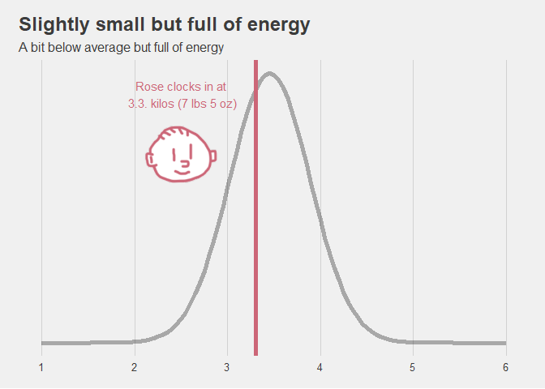
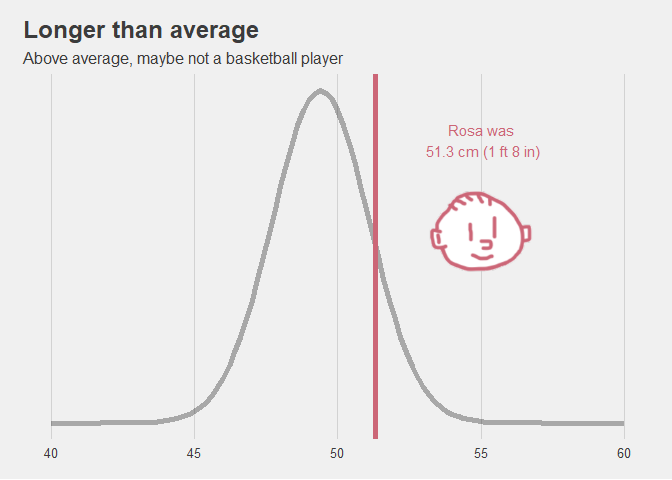
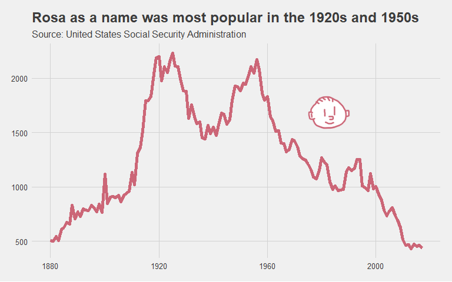
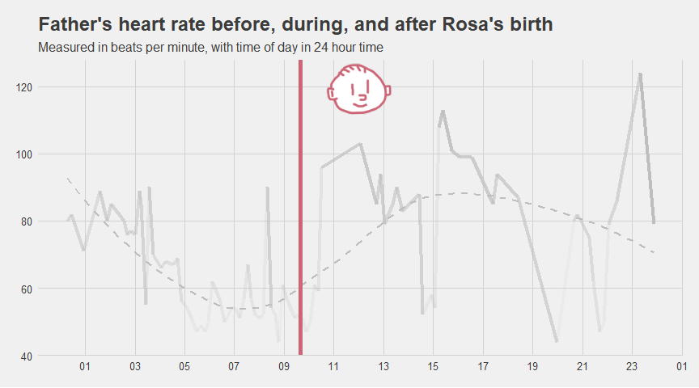
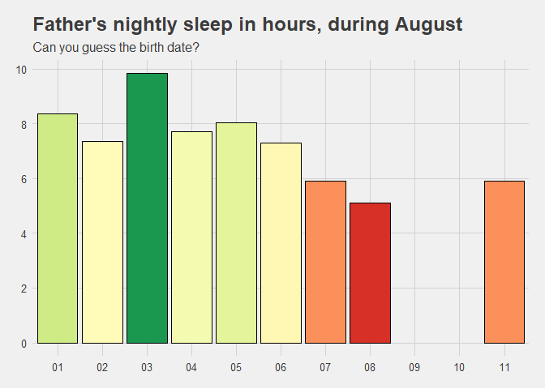

Announcing Rosa
================

A quick announcement that Rosa was born on August 7, 2020 at 9:39 AM.

Family and friends: see our [Baby
Instagram](https://www.instagram.com/bamacchetti/) for pictures.

Now for the numbers and context.

## Her stats

First of all, her basic statistics. These are the first questions almost
everyone has about babies - how heavy and how long? It’s helpful to put
these numbers in context by looking at how Rosa compares with other
Caucasian babies.

At **3.3 kilos (7 lbs 5 oz)** Rosa sits comfortably around the average.
If all babies were exactly the same size, we wouldn’t have a
distribution here (the “bell curve” below). We probably wouldn’t have
that many types of sports either if humans had the same body type.

I used data from [this
article](https://www.ncbi.nlm.nih.gov/pmc/articles/PMC2802014/) by
Janssen et al. (2017).

<!-- -->

Length wise, though, Rosa is somewhat above the average.

<!-- -->

## What’s in a name?

Rosa was named after her great grandmother. Her name follows the
Portuguese pronounciation, which differs mainly in the “R” - it’s
different than in English or the rolling R in Spanish. It’s tricky. See
the pronunciation of Rosa
[here](https://www.infopedia.pt/dicionarios/lingua-portuguesa/rosa) and
a breakdown of the “R” sound [here](https://youtu.be/3jdovKE2f4I?t=366).

## How common is Rosa as a name?

In the United States in 2017, around 400 Rosas were born, which is 0.02%
of all children that year.

The big question is: **What is the possibility that Rosa will be in a
class with someone with the same name?** And have to go by Rosa S. and
always get confused with another kid?

It turns out the chance Rosa will be in a class with another Rosa is
about **1 in 200**. Which is pretty unlikely.

Here I’m assuming classes are 20 kids and the popularity of names in
2020 is similar to 2017.

<!-- -->

Unfortunately for girls named Emma, the most popular name in 2017 (and
1% of all babies), their chances are 1 in 5.

<!-- -->

## How popular was the name Rosa over time?

Rosa is a pretty classic name, going at least back to 1880, when the
Social Security Administration started tracking baby names.

It peaked in popularity in two decades: the 1920s and 1950s. Perhaps the
influence of Rosa Luxemburg and Rosa Parks?

<!-- -->

## What kind of names are similar?

**Given the popularity of Rosa over time, are there names with a similar
trend?** It seems Miriam is a close contender, along with Priscilla.
Jenny (as opposed to Jennifer) had a similar trend, but peaked in the
1970s. Cassidy is an example of a name that is relatively new, but like
the other names, is less popular since the 2000s.

Thanks to [this analysis](https://rpubs.com/jalapic/babynames) for the
inspiration and the code.

<!-- -->

## How the parents are doing

Inadvertently I had my smart watch on during the birth, which captured
my heart rate over time. It’s no surprise it went up after we saw the
baby for the first time.

<!-- -->

My watch also tracks sleep, which gives a pretty accurate portrayal of
pre and post-partum sleep habits (okay, on the dad's side). However, the 
watch can only record sleep that is longer than 3 hours per stint - 
the 9th and 10th were pretty tough.

<!-- -->

-----

Welcome to the world, Rosa\! There will be lots of adventures, numbers,
and trends out there for you to explore.

Created by [Richard Bamattre](https://twitter.com/rbamattre). My partner
says I have too much time on my hands since taking paternity leave.
